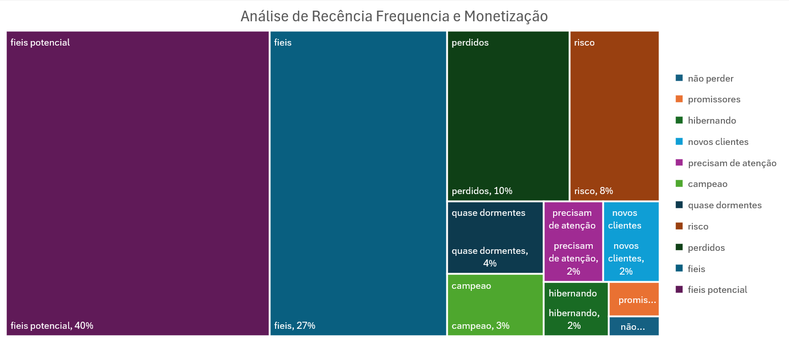

# Problema de negócio

Como Analista de Dados, minha missão é resolver os problemas de negócio utilizando Excel como ferramenta principal. Você deve aplicar os conceitos estudados em aula para criar um projeto consolidado que responda às seguintes perguntas de negócio:
**Análise de Cohort:**
- Qual é a retenção de clientes ao longo dos meses?
- Quais cohorts apresentam maior retenção?
- Existem fatores sazonais que impactam a retenção?

**Segmentação RFM:**
- Quem são os “Campeõesˮ e “Clientes em Riscoˮ?
- Como os clientes estão distribuídos entre os segmentos RFM?
- Quais ações podem ser tomadas para fidelizar clientes ou recuperar os clientes em risco?

**Desempenho de Produtos e Localizações:**
- Quais produtos geram maior receita e quais possuem baixo desempenho?
- Existe uma relação entre o desempenho das lojas e as regiões em que estão localizadas?

# Contexto
A SuperStore, uma das maiores redes de supermercados do país, enfrenta desafios relacionados à retenção de clientes e à melhoria das suas estratégias de vendas. A empresa possui dados ricos sobre seus clientes, pedidos, localizações e produtos, mas precisa de uma análise detalhada para tomar decisões baseadas em dados.
O time de gestão identificou três áreas principais para foco:
  -  Retenção de Clientes: Monitorar a interação de clientes ao longo do tempo (Análise de Cohort).
  - Segmentação de Clientes:  Identificar grupos específicos de clientes com base no comportamento de compra (RFM).
  - Desempenho de Produtos e Localizações: Avaliar quais produtos e lojas geram maior impacto no faturamento.

# Premissas da análise
1. A análise considerou como data mais recente para fins de cálculos de retenção e recência a data do ultimo pedido feito.
# Estratégia da solução 

Foi realizada análise descritiva e utilizado o método SAPE para apresentação dos resultados.
SAPE
	**1. Determinação das saídas:** 
		 Criar um painel interativo e um relatório consolidado que: 
  		1. Análise Cohort: tabela de retenção em formato de heatmap. 
  		2. Segmentação RFM: distribuição de clientes entre os segmentos. 
  		3. Desempenho de Produtos e Localizações: os produtos mais e menos vendidos.
	**2. Planejamento do processo:**
		 Realizar os 5 passos da análise descritiva: 
  		1. Definição do fato;
  		2. Definição das dimensões;
  		3. Definição das combinações fato-dimensão (análises);
  		4. Criação de gráficos para representar;
  		5. Dashboard de apresentação
	**3. Identificação das entradas:** 
		Fonte de Dados: base de dados em csv de pedidos da Superstore

# Principais descobertas e recomendações

**Cohort: Meses de Maior e Menor Retenção**
- **Mês de Maior Retenção:** Após realizar a análise de cohort, identificamos que o maior índice de retenção ocorreu nos cohorts de Janeiro e Março de 2024, com taxas de retenção superiores a 70% no segundo mês subsequente. Esses resultados podem estar associados a campanhas promocionais específicas realizadas no início do ano, como liquidações de estoque.
- **Mês de Menor Retenção**: O menor índice foi observado nos cohorts de Setembro de 2023, com retenção inferior a 30% no segundo mês subsequente. Isso pode indicar falta de campanhas de engajamento ou sazonalidade com baixa demanda.

**Recomendação**: Para melhorar a retenção nos períodos de baixa, implemente campanhas personalizadas, como descontos para clientes recentes e programas de fidelidade que incentivem compras recorrentes.

**RFM: Segmentos de Clientes Prioritários**
- **Campeões**: Identificamos 12% dos clientes como “Campeõesˮ, caracterizados por compras frequentes, valores elevados e recência baixa (última compra recente). Eles são responsáveis por 35% da receita total.
- **Clientes em Risco:** Cerca de 18% dos clientes estão neste segmento, com alta recência e baixa frequência de compras. Este grupo representa 10% da receita total.

**Recomendação:**
- Para os “Campeõesˮ, ofereça benefícios exclusivos, como acesso antecipado a promoções e  programas VIP.
- Para os “Clientes em Riscoˮ, implemente estratégias de reativação, como cupons de desconto ou comunicação personalizada.

**Produtos e Localizações: Insights e Ações**

**Produtos de Melhor Desempenho:**
- O produto “Item Aˮ gerou a maior receita total, representando 15% das vendas, enquanto o “Item Cˮ teve o maior volume de vendas com ticket médio baixo.
- Produtos de Baixo Desempenho: “Item Dˮ apresentou baixo desempenho em todas as categorias, com vendas reduzidas mesmo em períodos promocionais.

**Recomendação:**
-  Reduza os preços ou implemente promoções para produtos com baixo desempenho.
- Para produtos de alta demanda, avalie o potencial de aumento de preço ou pacotes promocionais.

**Lojas com Melhor Desempenho:**
- As lojas localizadas nas regiões Sul e Sudeste geraram 60% da receita total, com maior engajamento de clientes recorrentes.

**Lojas com Baixo Desempenho:**
- As lojas no Nordeste apresentaram o menor índice de vendas, sugerindo possível desalinhamento entre estoque e demanda local.

**Recomendação:**
- Personalize o mix de produtos com base nas preferências regionais.
- Invista em campanhas regionais para aumentar o tráfego nas lojas de menor desempenho.

